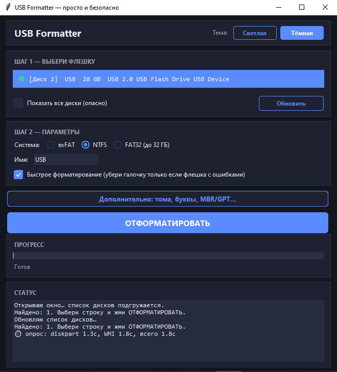
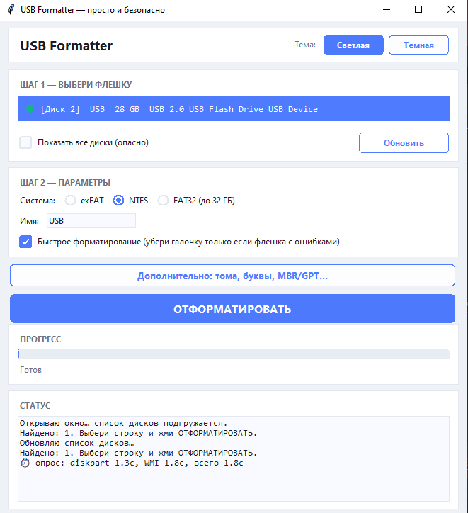
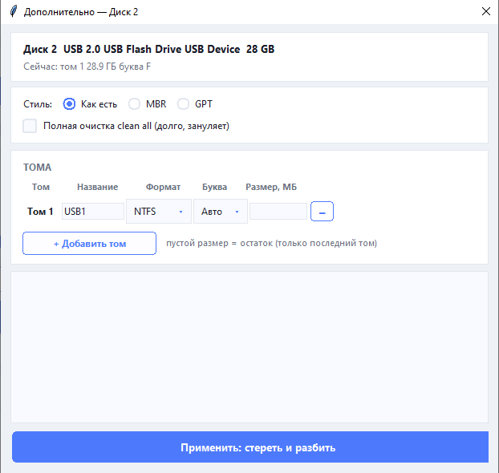

# USB Formatter

Простая и безопасная утилита для форматирования USB-флешек на Windows.
Выбрал флешку → нажал одну кнопку → готово.

## Скриншоты





## Кому пригодится

- **После загрузочной флешки.** Запись ISO-образа (Rufus, Ventoy, dd и т.п.) разбивает флешку на несколько разделов, часть из которых Windows даже не показывает, а доступный объём «съёживается». Программа убирает лишние разделы и возвращает один том на весь объём.
- **После неудачного форматирования.** Флешка не отображается в Проводнике и стандартных средствах Windows, определяется как RAW или система бесконечно просит её отформатировать.
- **Флешка «стала меньше».** Остатки старых разделов и скрытые области съедают место — очистка возвращает полный заводской объём.
- **Нужно несколько томов на одной флешке.** Например, разделить документы и загрузочный раздел с выбором букв и файловых систем.
- **Передача флешки в чужие руки.** Полная очистка с занулением (`clean all`) надёжно стирает данные.
- **Страшно лезть в diskpart.** Всё то же самое, что делается консолью, — но одной кнопкой и с защитой от форматирования системного диска.

## Возможности

- Форматирование в один клик: NTFS / exFAT / FAT32 (до 32 ГБ), быстрое или полное
- Безопасность: системный диск скрыт из списка и заблокирован в коде, двойное подтверждение, проверка выбора диска до очистки
- Разбивка на 1–4 тома с выбором буквы, метки и стиля разделов MBR/GPT (`Дополнительно`)
- Прогресс с процентами и оценкой оставшегося времени
- Светлая и тёмная темы
- Всегда запускается с правами администратора (UAC)

## Запуск

```bat
python USB_Format.py
```

Нужен Windows + Python 3. Требуется запуск от администратора — программа сама запросит повышение через UAC.

Текстовый режим (старый):

```bat
python USB_Format.py --console
```

## Сборка в exe

```bat
python -m PyInstaller --onefile --noconsole --uac-admin --name USB_Format --icon USB_Format.ico USB_Format.py
```

Готовый файл: `dist\USB_Format.exe`

## Как это работает

Всё форматирование выполняется через `diskpart` (`clean`, `create partition primary`, `format`, `assign`), данные о дисках — через PowerShell (`Win32_DiskDrive`, `Get-Partition`). На время операции `automount` отключается, чтобы Windows не показывала системное окно «Нужно отформатировать диск».

## Стек

Python, tkinter, diskpart, PowerShell
